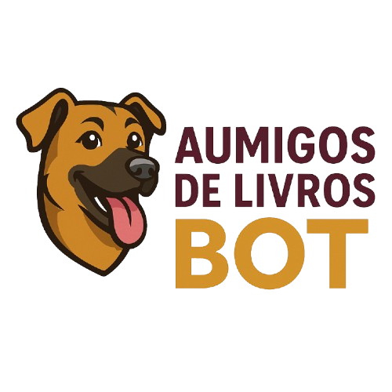

# 🐶📚 AumigodeLivrosBot

<p align="center">
  <a href="https://github.com/cleitonleonel/AumigosDeLivrosBot">
    
  </a>
</p>

<p align="center">
  <i>Um bot para auxiliar o Instituto Aumigos de Livros na divulgação, arrecadação de doações e engajamento com apoiadores.</i>
</p>

<p align="center">
<a href="https://github.com/cleitonleonel/AumigosDeLivrosBot">
  
  
  
</a>
</p>


## 🧾 Observação:
Este projeto foi desenvolvido em cumprimento ao curso de Análise e Desenvolvimento de Sistemas e ao Projeto Integrador II B da FAESA.

---

## 📋 Pré-requisitos

- Python 3.11 ou superior
- Conta no Telegram
- API ID e API Hash do Telegram
- Token do Bot (via BotFather)

---

## 🚀 Instalação

### 1. Instalar dependências

```bash
pip install telethon
```

### 2. Obter credenciais do Telegram

#### **API ID e API HASH**
1. Acesse: https://my.telegram.org
2. Faça login com seu número de telefone
3. Vá em "API Development Tools"
4. Crie um novo app
5. Anote o `api_id` e `api_hash`

#### **Bot Token**
1. Abra o Telegram e fale com [@BotFather](https://t.me/BotFather)
2. Envie o comando `/newbot`
3. Escolha um nome: `Aumigos Bot`
4. Escolha um username: `@AumigosBot` (ou outro disponível)
5. Copie o token fornecido

### 3. Configurar o bot

Edite o arquivo `config_dev.toml` e o renomeie para `config.toml`, insira suas credenciais:

```
API_ID = 12345678  # Seu API ID
API_HASH = 'seu_api_hash_aqui'
BOT_TOKEN = 'seu_token_do_botfather_aqui'
```

### 4. Executar o bot

```bash
python main.py
```

---

## 🎯 Funcionalidades

### Menus Disponíveis

- **📖 Conhecer a ONG** - História e números do Instituto
- **📚 Doar Livros** - Como doar e enviar livros
- **🛒 Comprar Livros** - Acesso à loja online
- **🙋‍♀️ Voluntariado** - Informações sobre ser voluntário
- **📅 Próximos Eventos** - Agenda de eventos
- **💝 Como Ajudar** - Todas as formas de contribuir
- **🌐 Redes Sociais** - Links e contatos

### Comandos

- `/start` - Iniciar conversa com o bot
- `/ajuda` - Ver comandos e FAQ
- `/doar` - Informações sobre doação de livros
- `/comprar` - Acessar loja de livros
- `/voluntario` - Ser voluntário
- `/eventos` - Ver próximos eventos
- `/contato` - Informações de contato
- `/adotar` - Sobre adoção de animais

### Respostas Automáticas

O bot responde automaticamente a palavras-chave como:
- "ajuda", "como ajudar"
- "localização", "endereço", "onde fica"
- "adotar", "adoção"
- "novidades", "redes sociais", "instagram"
- "obrigado", "obrigada"

---

## ⚙️ Configuração do BotFather

Após criar o bot, configure-o com o @BotFather:

### Descrição (Bio)
```
/setdescription
```
Texto:
```
Sou o bot oficial do Instituto Aumigos de Livros 🐶📚. Aqui você conhece nossa história, apoia resgates de animais e participa de ações de doação de livros.
```

### Sobre (About)
```
/setabouttext
```
Texto:
```
Bot do Instituto Aumigos de Livros - Transformando livros em vidas salvas! 🐶📚
```

### Foto de perfil
```
/setuserpic
```
Envie uma imagem do logo ou mascote da ONG.

### Comandos do Menu
```
/setcommands
```
Cole esta lista:
```
start - Iniciar conversa
ajuda - Ver ajuda e FAQ
doar - Doar livros
comprar - Comprar livros
voluntario - Ser voluntário
eventos - Próximos eventos
contato - Contato e localização
adotar - Adoção de animais
```

---

## 🔧 Personalizações Necessárias

Antes de colocar o bot em produção, você deve atualizar:

### 1. Links e URLs

Procure no código por `[inserir URL]`, `[Link da Loja]`, `[Link do Formulário]` e substitua pelos links reais:

```python
# Exemplo:
"Acesse nosso catálogo completo:\n"
"https://loja.aumigosdelivros.org.br\n\n"
```

### 2. Endereços e Contatos

Procure por `[Inserir endereço completo]`, `[inserir número]`, `[inserir email]` e atualize:

```python
LOCALIZACAO = """
📍 **Nossa Localização**

**Endereço do Abrigo:**
Rua Exemplo, 123
Bairro: Centro
Cidade: São Paulo - SP
CEP: 01234-567
...
"""
```

### 3. Redes Sociais

Atualize os handles reais:

```python
REDES_SOCIAIS = """
🌐 **Nossas Redes Sociais**

📸 **Instagram:** @aumigodelivros_real
🌐 **Site:** https://aumigodelivros.org.br
📧 **E-mail:** contato@aumigodelivros.org.br
📱 **WhatsApp:** (27) 12345-4321
💼 **CNPJ:** 12.345.678/0001-90
...
"""
```

### 4. Horários e Informações

Atualize horários de funcionamento, dias de eventos, etc.

---

## 🎨 Adicionando Imagens

Para enviar imagens junto com as mensagens:

```python
# Exemplo para enviar foto com a história
@bot.on(events.NewMessage(pattern='/start'))
async def start(event):
    await event.respond(
        file='caminho/para/imagem.jpg',  # Adicione o caminho da imagem
        message=MENSAGEM_BOAS_VINDAS,
        buttons=menu_principal()
    )
```

---

## 📊 Logs e Monitoramento

Para adicionar logs ao bot, adicione no início do arquivo:

```python
import logging

logging.basicConfig(
    format='[%(levelname)s/%(asctime)s] %(name)s: %(message)s',
    level=logging.INFO
)
```

Isso permitirá ver mensagens de debug e erros no console.

---

## 🔒 Segurança

### Boas Práticas

1. **Nunca commite credenciais** no Git
2. Use variáveis de ambiente:

```python
import os
from dotenv import load_dotenv

load_dotenv()

API_ID = os.getenv('API_ID')
API_HASH = os.getenv('API_HASH')
BOT_TOKEN = os.getenv('BOT_TOKEN')
```

3. Crie um arquivo `.env`:
```
API_ID=12345678
API_HASH=seu_api_hash
BOT_TOKEN=seu_token
```

4. Adicione `.env` ao `.gitignore`:
```
.env
*.session
__pycache__/
```

---

## 📱 Deploy

### Opção 1: Servidor Local
```bash
# Manter rodando em background
nohup python aumigos_bot.py &
```

### Opção 2: Heroku

1. Crie um `Procfile`:
```
worker: python aumigos_bot.py
```

2. Crie `requirements.txt`:
```
telethon
python-dotenv
```

3. Deploy:
```bash
heroku create aumigos-bot
git push heroku main
heroku ps:scale worker=1
```

### Opção 3: PythonAnywhere

1. Faça upload dos arquivos
2. Configure um "Always-on task"
3. Execute o script

### Opção 4: VPS (Recomendado)

```bash
# Instalar supervisord para manter o bot rodando
sudo apt install supervisor

# Criar config
sudo nano /etc/supervisor/conf.d/aumigos_bot.conf
```

Conteúdo:
```ini
[program:aumigos_bot]
command=/usr/bin/python3 /caminho/para/aumigos_bot.py
directory=/caminho/para/
user=seuusuario
autostart=true
autorestart=true
stderr_logfile=/var/log/aumigos_bot.err.log
stdout_logfile=/var/log/aumigos_bot.out.log
```

```bash
sudo supervisorctl reread
sudo supervisorctl update
sudo supervisorctl start aumigos_bot
```

---

## 🆕 Funcionalidades Futuras

Ideias para expandir o bot:

### 1. Sistema de Doações
```python
# Adicionar botão de doação PIX
Button.url("💰 Doar via PIX", "https://link-para-pagamento")
```

### 2. Catálogo de Livros
```python
# Mostrar livros disponíveis com fotos
@bot.on(events.CallbackQuery(data=b"catalogo"))
async def mostrar_catalogo(event):
    livros = [
        {"titulo": "1984", "autor": "George Orwell", "preco": "R$ 25", "foto": "url"},
        # ... mais livros
    ]
    # Enviar carrossel de livros
```

### 3. Sistema de Busca
```python
@bot.on(events.NewMessage(pattern='/buscar (.+)'))
async def buscar_livro(event):
    termo = event.pattern_match.group(1)
    # Buscar no banco de dados
    await event.respond(f"Procurando por: {termo}")
```

### 4. Notificações Automáticas
```python
# Enviar novidades para todos os usuários
import asyncio

async def enviar_novidades():
    usuarios = [...] # Lista de IDs de usuários
    for user_id in usuarios:
        await bot.send_message(user_id, "🎉 Nova feira este sábado!")
```

### 5. Estatísticas
```python
# Contar quantas pessoas usaram cada função
user_stats = {}

@bot.on(events.CallbackQuery)
async def rastrear_cliques(event):
    user_id = event.sender_id
    # Salvar estatística
```

---

## 🐛 Troubleshooting

### Erro: "Cannot find API ID"
- Verifique se você configurou corretamente `API_ID`, `API_HASH` e `BOT_TOKEN`

### Erro: "ConnectionError"
- Verifique sua conexão com a internet
- Tente usar um proxy se necessário

### Bot não responde
- Verifique se o bot está rodando: `ps aux | grep aumigos_bot.py`
- Veja os logs para identificar erros

### Sessão expirada
- Delete o arquivo `.session` e execute novamente

---

## 📞 Suporte

Se precisar de ajuda:

1. Consulte a documentação do Telethon: https://docs.telethon.dev/
2. Verifique os logs do bot
3. Entre em contato com a equipe técnica

---

## 📄 Licença

Este projeto foi desenvolvido para o Instituto Aumigos de Livros.

---

## 👥 Contribuindo

Para contribuir com melhorias:

1. Fork o projeto
2. Crie uma branch: `git checkout -b feature/nova-funcionalidade`
3. Commit suas mudanças: `git commit -m 'Adiciona nova funcionalidade'`
4. Push para a branch: `git push origin feature/nova-funcionalidade`
5. Abra um Pull Request

---

## 🙏 Agradecimentos

Desenvolvido com 💚 para o Instituto Aumigos de Livros - Transformando livros em vidas salvas!

**"O que mais doamos é o nosso tempo. Nossos finais de semana, nossos dias, nossa atenção. A causa animal merece!"** - Magali Gláucia

---

## 📈 Roadmap

- [x] Menu principal interativo
- [x] Comandos básicos
- [x] Respostas automáticas
- [ ] Integração com banco de dados
- [ ] Catálogo de livros dinâmico
- [ ] Sistema de doações online
- [ ] Notificações push
- [ ] Dashboard de estatísticas
- [ ] Sistema de adoção integrado
- [ ] Galeria de animais resgatados
- [ ] Blog de histórias de sucesso

---

**Última atualização:** Outubro 2025
**Versão:** 1.0.0